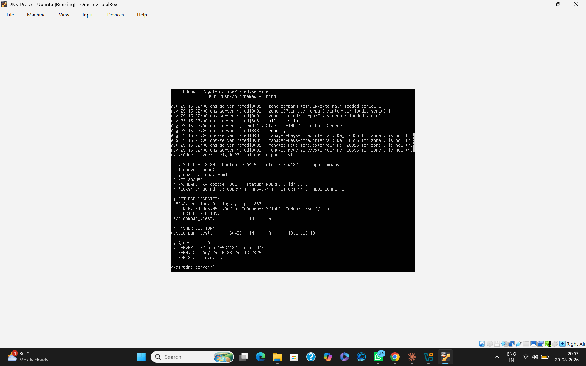
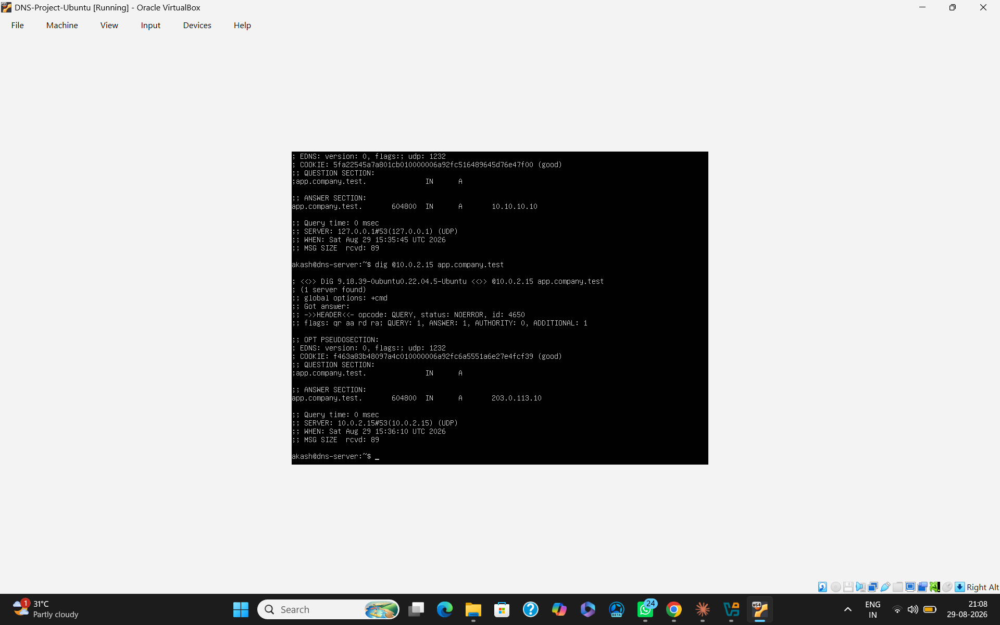
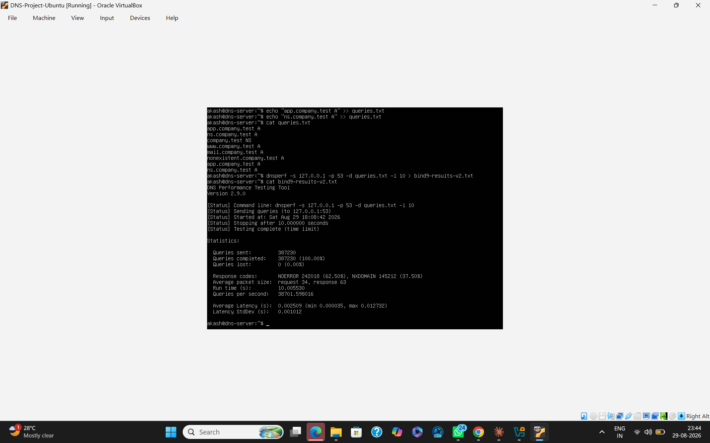
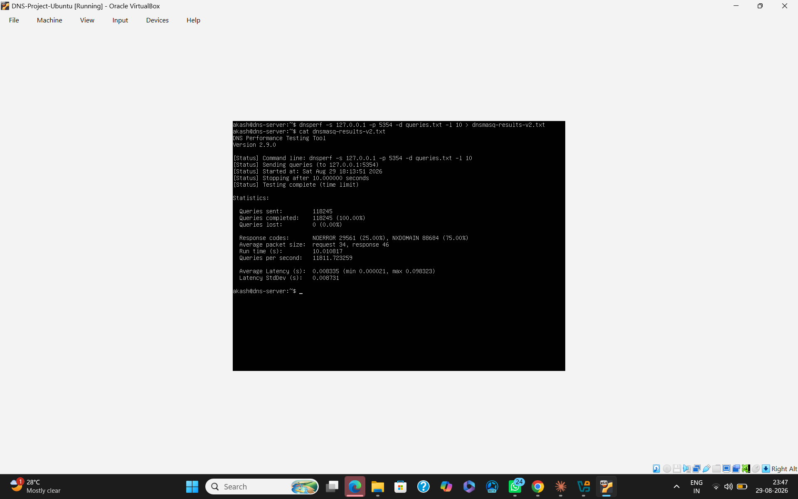
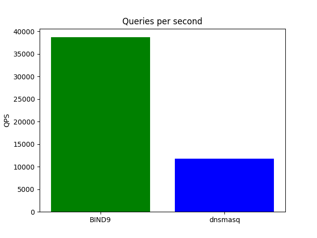
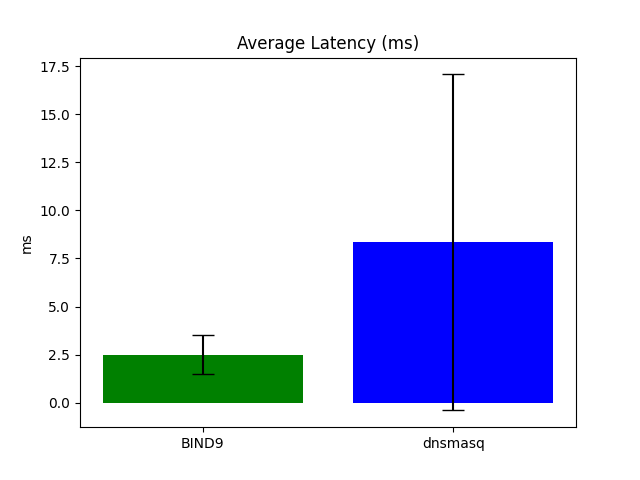
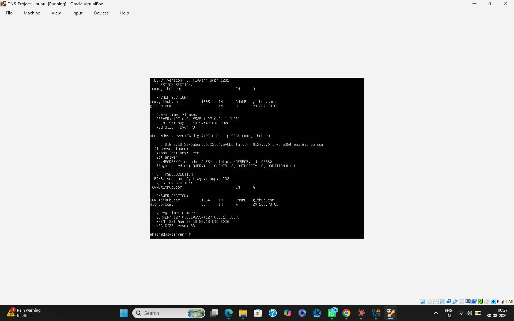
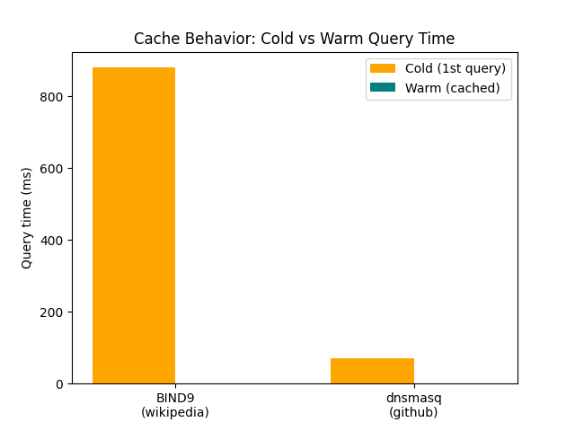

# Split-Horizon DNS with BIND9 vs dnsmasq — Performance Benchmarking Under Query Load

**Stack used:** BIND9, dnsmasq, dnsperf, dig
**Environment:** VirtualBox VM running Ubuntu Server 22.04.5 LTS (hostname `dns-server`), 4096MB RAM, 2 vCPUs, NAT networking, accessed from a Windows host machine.

## Setting up the environment

I started by creating a VirtualBox VM dedicated to this project and installing Ubuntu Server 22.04.5 on it. Since it's a server install with no desktop environment, everything from here on was done through the terminal — SSH was enabled early on so I could also transfer files between the VM and my Windows host later when I needed to (more on that below).

Once the base OS was up, I installed the four core tools this project needed: `bind9`, `dnsmasq`, `dnsutils` (for `dig`), and `dnsperf`.

The first real snag was a **port conflict** — BIND9 needs port 53, and dnsmasq defaults to the same port. Since the goal was to run both simultaneously for a fair comparison, I reconfigured dnsmasq to listen on port 5354 instead, by adding `port=5354` to `/etc/dnsmasq.conf`. I hit a small parsing issue here too — a stray `#` comment character in the config that I'd left in from editing — which I had to track down and remove before dnsmasq would restart cleanly. After that fix, `systemctl status` confirmed both services running side by side without conflict.

## Building split-horizon DNS in BIND9

This is the core of the project — making the same domain name resolve to different IP addresses depending on whether the query comes from "inside" or "outside" the network, which is exactly what real companies do to hide internal service addresses from the public internet while still using a friendly, single domain name internally and externally.

I set this up in `/etc/bind/named.conf.local` using two ACLs and two views:

```
acl "internal" { 127.0.0.1; };
acl "external" { any; };

view "internal" {
    match-clients { internal; };
    include "/etc/bind/named.conf.default-zones";
    zone "company.test" {
        type master;
        file "/etc/bind/zones/db.internal.company.test";
    };
};

view "external" {
    match-clients { external; };
    include "/etc/bind/named.conf.default-zones";
    zone "company.test" {
        type master;
        file "/etc/bind/zones/db.external.company.test";
    };
};
```

One decision worth explaining: I originally wanted the `internal` ACL to match the whole `10.0.0.0/8` range, since that's a typical private-network convention. But because this whole setup lives on a single VM, the VM's own interface address (`10.0.2.15`, assigned by VirtualBox's NAT) also falls inside `10.0.0.0/8` — so every query, including ones I intended to test as "external," was incorrectly matching the internal view. I narrowed the ACL down to just `127.0.0.1` instead. This is a simplification that only makes sense in a single-VM demo like this one — in a real multi-host network you'd scope the ACL to your actual internal subnet — but it was necessary here to get a genuine, testable internal/external split.

Another thing that tripped me up: BIND9 doesn't allow a top-level `include "named.conf.default-zones";` once you're using views — all zones, including the default ones, have to live inside a view. I had to remove that original top-level include from `named.conf` and instead include it separately inside both the `internal` and `external` view blocks.

For the zone files themselves, I kept the SOA record on a single line rather than the usual multi-line parenthesized format, because typing the multi-line version by hand (no working copy-paste into the VM at this stage) kept producing "unexpected end of input" errors from BIND9's parser — almost certainly from a missed line break or stray character. The single-line version is functionally identical and avoided that whole class of typo:

```
$TTL 604800
@ IN SOA ns.company.test. admin.company.test. ( 1 604800 86400 2419200 604800 )
@ IN NS ns.company.test.
ns IN A 10.10.10.1
app IN A 10.10.10.10
```

(The external zone file, `db.external.company.test`, is structured identically but uses `203.0.113.1` and `203.0.113.10` in place of the internal addresses.)

Both zone files passed `named-checkzone` cleanly, and after restarting BIND9 the logs confirmed both views loaded successfully.

**Proof it actually works (via dig):**

```
dig @127.0.0.1 app.company.test        → 10.10.10.10   (internal view)
dig @10.0.2.15 app.company.test        → 203.0.113.10  (external view)
```




Same domain name, two genuinely different, correct answers, purely based on which address the query came from. That's split-horizon DNS working as intended.

## Configuring dnsmasq for comparison

For dnsmasq, I added one static mapping to `/etc/dnsmasq.conf`:

```
address=/app.company.test/203.0.113.10
```

Verified with:
```
dig @127.0.0.1 -p 5354 app.company.test   → 203.0.113.10
```

Here's an important finding that's easy to miss if you don't actually try to replicate the setup: **dnsmasq has no equivalent of BIND9's views.** There's no way to make it return a different answer based on client source — every client gets the same static answer, always. This isn't a configuration gap on my part; it's a genuine architectural limitation of dnsmasq, which is built as a lightweight forwarder/cache for smaller networks, not as a multi-view authoritative server. I configured it with a single equivalent record purely so the performance benchmarking that follows would be a fair, like-for-like comparison on raw query handling, even though the split-horizon comparison itself has to stop here.

## Load testing with dnsperf

For the actual "performance benchmarking under query load" part of the brief, I used `dnsperf` to fire repeated queries at both servers and compare throughput and latency.

My first attempt used a query file with just one line (`app.company.test A`), repeated for 10 seconds. It technically worked — 100% success, ~40,800 queries/sec against BIND9 — but I realized afterward that hammering one already-cached record isn't a very meaningful load test; it never exercises a miss path or tests correctness on names that don't exist. So I rebuilt the query file with a more realistic mix of 8 lines: some real records, some intentionally non-existent names (to trigger NXDOMAIN), and a couple of repeats:

```
app.company.test A
ns.company.test A
company.test NS
www.company.test A
mail.company.test A
nonexistent.company.test A
app.company.test A
ns.company.test A
```

Running this same file against both servers for 10 seconds each gave the actual comparison numbers for this project:

| Metric | BIND9 (port 53) | dnsmasq (port 5354) |
|---|---|---|
| Queries completed | 387,230 (100%) | 118,245 (100%) |
| Queries lost | 0 | 0 |
| Queries per second | 38,701.60 | 11,811.72 |
| Average latency | 2.509 ms | 8.335 ms |
| Latency std. deviation | 1.012 ms | 8.731 ms |
| Response codes | 62.5% NOERROR / 37.5% NXDOMAIN | 25% NOERROR / 75% NXDOMAIN |







The response-code split looks different between the two servers, but it's not a bug or inconsistency — it's a direct consequence of what each server actually has configured. BIND9 knows about two real names (`ns` and `app`), so more of the 8-line query file resolves successfully against it. dnsmasq only knows about one (`app`), so a larger share of the same query file legitimately comes back as NXDOMAIN.

The throughput and latency gap is the more interesting finding: BIND9 handled roughly 3.3x more queries per second than dnsmasq under the same load, and its latency was both lower and far more consistent (a standard deviation of about 1ms vs. dnsmasq's 8.7ms, meaning dnsmasq's response times varied a lot more query to query). I won't claim to know the exact internal reason without profiling both binaries directly, but it lines up with what each tool is designed for — BIND9 as a dedicated, optimized authoritative nameserver, dnsmasq as a lightweight all-purpose forwarder that trades raw throughput for simplicity and a smaller footprint.

## Cache behavior — the part that needed a second attempt

My first pass at testing cache behavior was querying each server's own configured record twice in a row with `dig`:

```
dig @127.0.0.1 app.company.test          → 0 msec (both times)
dig @127.0.0.1 -p 5354 app.company.test  → 0 msec (both times)
```

Both came back instant every time, which at first looks like "no caching effect to report." But thinking it through more carefully: these are authoritative/static records that are already sitting in each server's memory the moment it starts — there's no external lookup step involved at all, so there's nothing for a cache to actually warm up. It's a valid result, but it doesn't really demonstrate caching.

To actually see real cache warming, I needed to query something neither server had any local knowledge of, forcing a genuine external/recursive lookup on the first try:

```
dig @127.0.0.1 www.wikipedia.org
   → 1st query: 880 msec (full recursive resolution: root → .org TLD → Wikipedia's authoritative servers)
   → 2nd query: 0 msec (served from BIND9's own cache)

dig @127.0.0.1 -p 5354 www.github.com
   → 1st query: 71 msec (forwarded to dnsmasq's upstream resolver)
   → 2nd query: 0 msec (served from dnsmasq's own cache)
```






TTL values in the dig output dropped between the two queries in both cases (e.g., BIND9's cached answer showed the TTL counting down from 86400 to 86341 seconds later), which confirms the second, instant answer genuinely came from cache rather than a coincidentally fast second lookup.

So the fuller picture on cache behavior is: both servers cache correctly once there's an actual external lookup to cache — the mechanism itself works identically in principle for both tools. The distinction only shows up when you separate "answering from your own zone/config" (always instant, nothing to warm up) from "resolving something external" (slow once, fast after).

## Generating the benchmark graphs

The three benchmark graphs referenced above (throughput, latency, and cache behavior) were generated using a short Python script (`graphs.py`, included in this repo under `scripts/`) with matplotlib, run directly on the VM using the real dnsperf and dig numbers collected earlier. Since the VM is a headless server with no desktop environment, the resulting PNG files couldn't be viewed directly inside it — they were transferred to the Windows host over `scp`, using an SSH port-forwarding rule (host port 2222 → guest port 22) set up in VirtualBox, and viewed there before being added to this repo.

## References

- ISC BIND9 Administrator Reference Manual — https://bind9.readthedocs.io/
- dnsmasq official documentation and man page — https://thekelleys.org.uk/dnsmasq/doc.html
- dnsperf tool documentation (DNS-OARC) — https://www.dns-oarc.net/tools/dnsperf
- `dig` / `named-checkzone` man pages (Ubuntu 22.04, `dnsutils` and `bind9utils` packages)
- RFC 1035 — Domain Names: Implementation and Specification
- Ubuntu Server 22.04 LTS official documentation — https://ubuntu.com/server/docs
